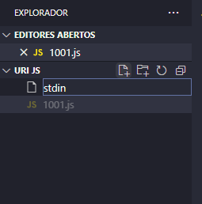
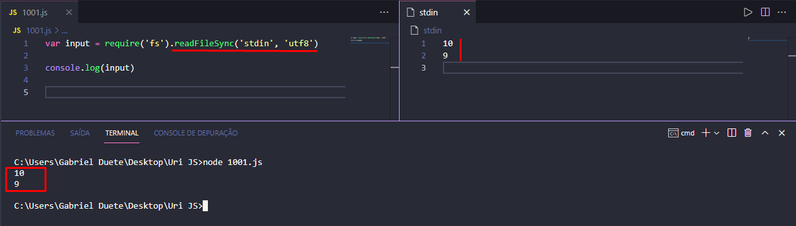
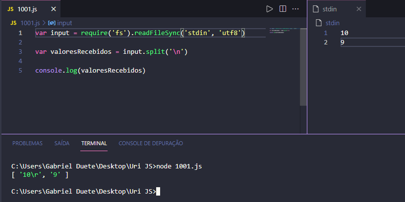
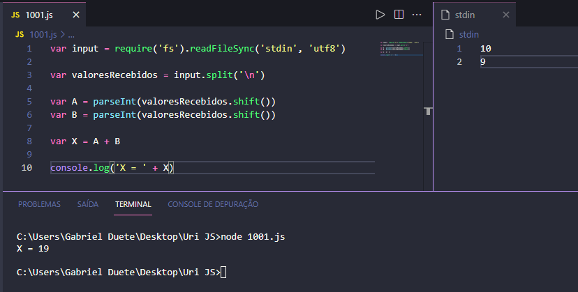

<h1 align='center'>
    URI PROBLEMAS COM JS + Guia
</h1>

# 🤠 Infos

- Repositório destinado a colocar meus problemas resolvidos no [URI](https://www.urionlinejudge.com.br/judge/pt) utilizando JavaScript.

- Guia de como resolver problemas do URI com JavaScript.

# 💻Tecnologias utilizadas

- [JavaScript](https://www.javascript.com/)

# 🤔 Ta com duvida em como enviar respostas com JS??

<p> 
Muitxs programadorxs sentem dificuldades em solucionar os problemas do URI com JavaScript por não entender como funciona a entrada de dados. Relaxa! Eu vou te explicar:

Primeiramente, crie uma arquivo chamado 'stdin' em sua pasta. Iremos usar esse arquivo para ler os valores do nosso problema!



Agora, vamos resolver o problema [1001](https://www.urionlinejudge.com.br/judge/pt/problems/view/1001) do URI. Para isso, temos que iniciar declarando o nosso input:

````
var input = require('fs').readFileSync('stdin', 'utf8')
````

Para recebermos os valores da entrada, precisamos fazer uma requisição do módulo conhecido como 'fs'. Este módulo fornece operações de I/O (Input/Output ou E/S, Entrada/Saída).

Não iremos entrar muito em detalhes de como o 'fs' funciona, pois iremos usar apenas a função [readFileSync](https://www.geeksforgeeks.org/node-js-fs-readfilesync-method/) do 'fs', essa função permite a leitura de forma síncrona do arquivo que iremos passar como parâmetro da função, junto com seu tipo de arquivo 'utf8'.

Ok, nosso input está pronto! Vamos testar? Entre no arquivo stdin e digite 10 e 9 um em cada linha, em seguida digite ```console.log(input)``` no código.



Perceba que foi impresso 10 e 9, conforme digitados no arquivo stdin! Pois o nosso input está lendo os valores digitados naquele arquivo. 

Vamos agora para o próximo passo!

````
var valoresRecebidos = input.split('\n')
````


Digite isso no seu código. Perceba que declaramos uma variável chamada *valoresRecebidos*, essa variável irá receber os valores do input e armazena-los. Mas, por que usar o método *.split*? A resposta é simples, o nosso input esta retornando uma string, então o método split irá criar uma lista ordenada de substrings de acordo com o nosso divisor, que no caso foi o "\n", pois precisamos quebrar linha na hora de receber os valores conforme o URI pede.

Vamos imprimir a variável *valoresRecebidos* para acompanhar o processo:



Perceba que foi retornada uma lista com os valores de acordo como nos separamos eles! No caso usando uma quebra de linhas igual o problema pede.

Agora ficou fácil! Só precisamos armazenar os valores 10 e 9 em suas respectivas variáveis, no caso *A* e *B*.

````
var A = parseInt(valor.shift())
var B = parseInt(valor.shift())
````

Ok... vamos entender o que foi feito! O método *[shift](https://developer.mozilla.org/pt-BR/docs/Web/JavaScript/Reference/Global_Objects/Array/shift)* em JavaScript remove o primeiro elemento de um array e retorna esse elemento. Ou seja, estamos pegando o primeiro elemento do array *valoresRecebidos* e jogando na variável *A*, em seguida pegamos o segundo elemento e jogamos na variável *B*. Mas não acabou por aí, perceba que temos que receber valores inteiros da entrada/inputs, ou seja, temos que converter o elemento que estamos recebendo do array para valores *inteiros*, para isso basta usarmos a função [*parseInt()*](https://developer.mozilla.org/pt-BR/docs/Web/JavaScript/Reference/Global_Objects/parseInt), essa função retorna um valor inteiro do elemento que estamos passando!

Pronto! Agora é só a gente criar a variável X e fazer a soma entre A e B!

````
var X = A + B
````

Por fim, nosso código ficará assim:

````
var input = require('fs').readFileSync('stdin', 'utf8')

var valoresRecebidos = input.split('\n')

var A = parseInt(valoresRecebidos.shift())
var B = parseInt(valoresRecebidos.shift())

var X = A + B

console.log('X = ' + X)
````
Vamos testa-lo para ver se ta funcionando conforme o URI deseja!



Aeee! Bingo! Você conseguiu resolver o problema 1001 do URI! Não pera... Ainda falta um maldito detalhe 😜. Sabe a nosso input que ta lendo o arquivo 'stdin'? Esse arquivo tem o mesmo nome do arquivo que compila e verifica as entradas no própio URI! Ou seja, com esse comando vamos estar acessando as pastas do URI e receber os valores da entrada. Só que o diretório do arquivo stdin do URI é diferente do nosso! Se enviarmos assim, nossa solução irá dar *Runtime error*. Para resolver esse problema, devemos apenas adicionar o "/dev/stdin" no nosso parâmetro da função 😀. 

Veja: 

````
var input = require('fs').readFileSync('/dev/stdin', 'utf8')
````

Agora sim! Hehehe, veja o resultado final: 

````
var input = require('fs').readFileSync('/dev/stdin', 'utf8')

var valoresRecebidos = input.split('\n')

var A = parseInt(valoresRecebidos.shift())
var B = parseInt(valoresRecebidos.shift())

var X = A + B

console.log('X = ' + X)
````

Parabéns!! Você conseguiu resolver o problema 1001 do URI com JavaScript, a linguagem mais bonita da internet (brincadeira... ou não...).

Se esse conteúdo foi útil para você, por favor clique na star do respositório, pois ficarei muito feliz em saber que de alguma maneira fiz algo útil para alguém da nossa comunidade. Me adiciona lá no URI pra gente ver nossas conquistas! Basta clicar aqui: [GabrielDuete-URI](https://www.urionlinejudge.com.br/judge/pt/profile/412152).

Muito obrigado por ter lido até aqui e ter aprendido, você é incrível mesmo 💜. Nunca desista dos estudos e continue focado mesmo com tantas dificuldades e coisas pra estudar, eu sei que você consegue!

<cite> 
<blockquote>"COM TRABALHO DURO UM FRACASSADO CONSEGUE ATÉ MESMO SUPERAR UM GÊNIO." - Rock Lee
</blockquote>
</cite>

</p>
